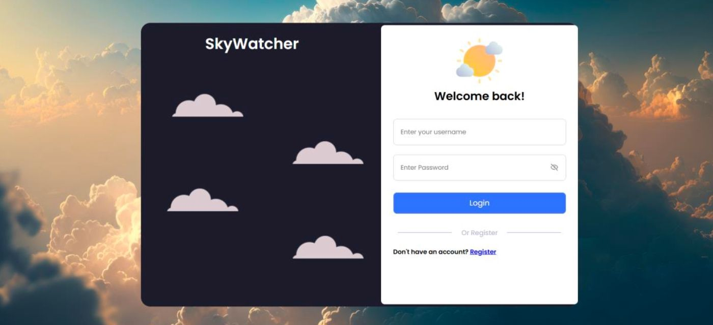

# SkyWatcher 🌤️

SkyWatcher is a responsive weather dashboard that lets users log in, pick a location and date, and view detailed weather insights in a clean, modern UI.

## Features

- **User Login/Registration**
  - Simple login screen with username & password fields.
  - Clear “Register” link for new users.

- **Location & Date Selection**
  - Dropdowns to select **country** and **city**.
  - Date picker to view weather for a specific day.

- **Current Conditions Panel**
  - Big, centered **temperature display** (°C).
  - Short description (e.g., *Clouds*, *Clear*, *Rain*).
  - Friendly “Hello, Your Name” header and logout button.

- **Average Data Section**
  - Bar chart summarizing:
    - Humidity (%)
    - Wind speed (m/s)
    - Cloudiness (%)
    - Temperature (°C)
    - Visibility (km)

- **Forecasting Hours**
  - Line chart of temperature through the day by hour (e.g., 11:00–16:00).
  - Helps users see trends rather than just a single value.

- **Detailed Metrics**
  - **Feels Like** temperature card with a slider-style visualization.
  - **Humidity** ring chart (percentage).
  - **Cloudiness** with percentage and a small progress bar.
  - **Wind Speed** (m/s).
  - **Visibility** (km).
  - **Atmospheric Pressure** (hPa).

- **Clean UI**
  - Light blue theme with cloud illustrations.
  - Card-based layout for each metric.
  - Designed to be intuitive even for non-technical users.

## Screenshots

### Dashboard

### Login Screen

## Tech Stack

- **Frontend:** HTML, CSS, JavaScript  
- **Charts:** Chart.js 
- **Backend / Database:** PHP, MySQL

## How It Works 

1. User logs in through the **login page**.
2. User selects **country**, **city**, and **date**.
3. The app fetches weather data from a weather API / database.
4. Data is displayed on the dashboard:
   - Current conditions on the left.
   - Charts and detailed cards in the main panel.
